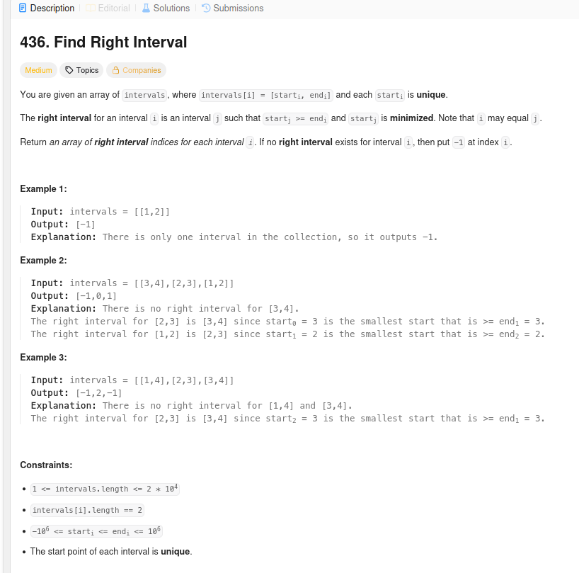
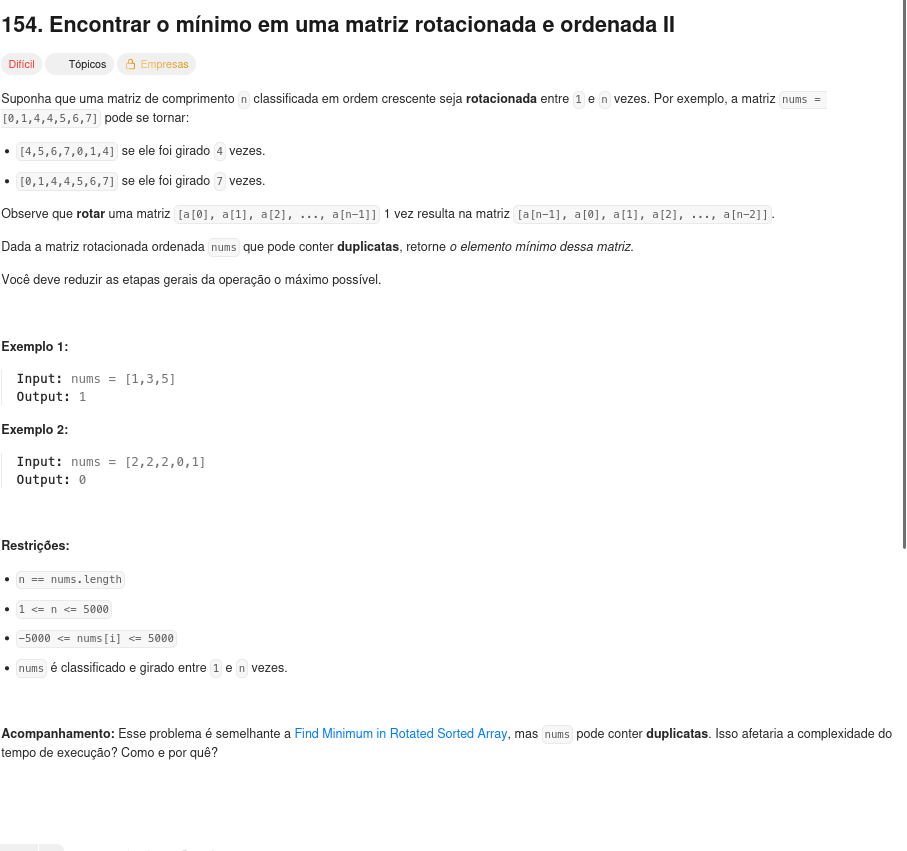
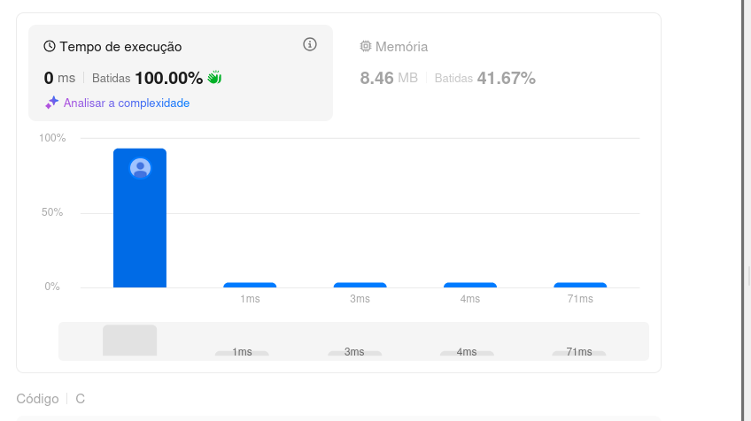
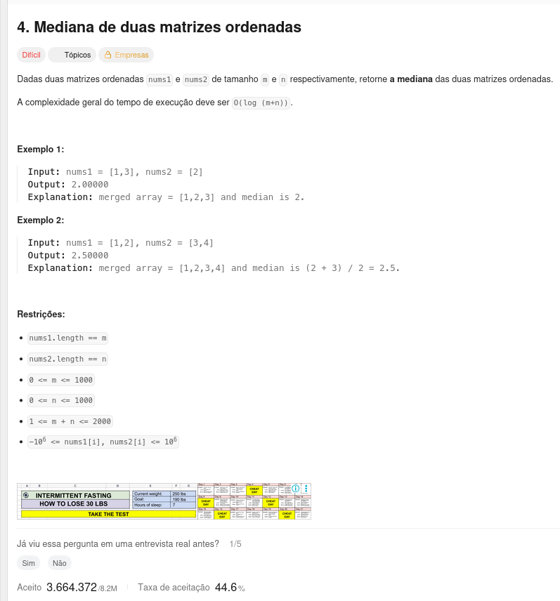

# Busca_LeetCode_GE

## Alunos  
| Matrícula | Nome |  
|-----------------------|---------------------|  
| 20/2023663 | Gabriel Basto Bertolazi |  
| 18/0100271 | Emivalto da Costa Tavares Junior |  
## Descrição do projeto

Esse repositório visa buscar a resolução dos exercícios escolhidos pela plataforma do LeetCode, com o objetivo de mostrar nossos conhecimentos aprendidos no conteúdo de grafos 1. Neles vamos aplicar conceitos e conhecimentos de lógica aprendidos na matéria de Projeto de Estruturas de dados 2 com o professor Maurício Serrano.

## Guia de instalação

sudo apt update && sudo apt install -y build-essential

### Dependências do projeto

Compilador C: GCC ≥ 10 ou Clang ≥ 12)

### Como executar o projeto

gcc questao_x.c -o questao_x && ./questao_x

##Entrega 1

[Apresentação 1 YouTube](https://youtu.be/89aU7mapD0k)

## Capturas de tela
### Questão 1

### Questão 2

### Resposta questão 2

### Questão 3

## Conclusões
Aqui você diz se o algoritmo utilizado foi útil, se tem limitações, etc.
## Referências
Caso tenha utilizado algum agoritmo como base, citar o mesmo devidamente para  evitar quaisquer denuncias de plágio.
